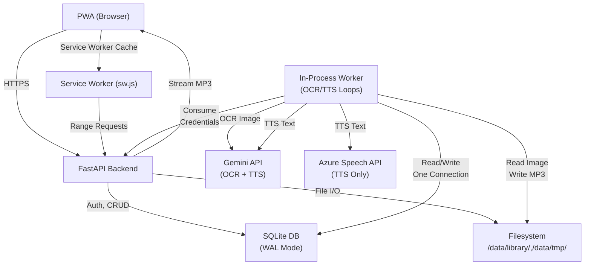

# System Architecture — BookSnap MVP

**Last updated:** 2026-09-29

## Component Overview



## Request & Data Flow

### 1. Capture → Upload → OCR → Chunking

```
User captures page (camera) 
    ↓
[Client] Canvas JPEG → Blob (RAM only)
    ↓
POST /api/books/{id}/pages
    ├─ Validate MIME + size (5 MB)
    ├─ Write to /data/tmp/{page_id}.jpg
    ├─ Insert page row: status='uploaded', seq from client
    ↓
[Worker — OCR Loop]
    ├─ Claim next page: SELECT … WHERE status='uploaded' 
    ├─ Read image bytes, call Gemini OCR
    ├─ Mark status='ocr_done', save text + continues_on_next_page flag
    ├─ Delete temp image
    ├─ Wake chunker
    ↓
[Worker — Chunk Loop]
    ├─ List pages with chunked=0
    ├─ For each book, walk contiguous seqs from 0
    ├─ Stop at first missing/failed/non-ocr_done page (ordering invariant)
    ├─ Incorporate pages' text into carry string (join with space or \n\n)
    ├─ Split carry via chunker.chunk_text (1000–1500 chars; paragraph breaks kept as one newline per chunk)
    ├─ Replace unsealed tail chunk: DELETE old, INSERT pieces
    ├─ Mark pages chunked=1
    ↓
[Worker — TTS Loop] (repeats every poll_seconds=2)
    ├─ Claim next pending chunk: SELECT … WHERE status='pending' AND sealed=1
    │   OR (tail AND book idle > grace_seconds)
    ├─ Hash(text, provider, voice): check if audio exists on disk
    ├─ If miss: call TTS provider with text_chunker.spoken_text(text) — paragraphs flattened,
    │   full stop added after headings so the voice pauses (respects RPM limiter + quota pause)
    ├─ Get MP3 bytes, write to /data/library/{book_id}/{seq:05d}-{hash[:8]}.mp3
    ├─ Mark status='done', store content_hash + claim_token
    ├─ On quota (429): mark status='waiting_quota', set not_before, pause provider
    ├─ On error: mark status='failed'
    ↓
[Client — Reader]
    ├─ Poll GET /api/books/{id}/chunks
    ├─ For each chunk: display text (one <p> per paragraph; short unpunctuated lines as headings), audio_url (if done)
    ├─ <audio> Range-request MP3 from /api/chunks/{id}/audio
    ├─ SW passes through (online) or serves from cache (offline)
    ├─ Track progress: local 5s → server 15s debounce
```

### 2. Ordering Invariant (Chunking Correctness)

**Goal:** No text scramble; no lost pages; handle retry + discard.

**Rule:** Chunks walk `seq = 0, 1, 2, …` and stop at the first "not ready" page:
- Missing: upload hasn't arrived yet
- Failed: OCR failed, retry not pressed, image not expired
- Not OCR'd: still `uploaded` or `ocr_processing`
- **Exception:** `discarded` pages are skipped (dead marker)

**Example:**
```
Pages:     [0:ocr_done, 1:ocr_done, 2:failed, 3:ocr_done, 4:discarded, 5:ocr_done]
Chunks:    [0–1 merged] → blocked at seq 2 (failed) → chunks [4–5] unreachable
User:      Press "Retry" on page 2 → pages.status='ocr_processing' → chunks unblock next tick
           Or press "Discard" on page 2 → pages.status='discarded' → chunks [2, 3, 4, 5] fold in
```

**Enforcement:** SQL `contiguous from 0` loop in `chunker_worker.py:37–58`. Breaking the invariant client-side (N2 gap) leaves a permanent stall until user manual discard on status view.

### 3. Tail-Chunk Sealing (Synthesis Safety)

**Problem:** Don't synthesize text that might change (pages added later, user edit).

**Solution:** TTS can only claim:
1. **Sealed chunks** (`sealed=1`) — immutable, chunker will never touch again
2. **Unsealed tail** if the book is idle — no page activity for `tail_seal_grace_seconds=90s`

**How it works:**
- Chunker always preserves 1 unsealed (`sealed=0`) tail chunk
- `ChunkRepository.claim_next_pending`: atomic SQL check
  ```sql
  UPDATE chunks SET status='processing', sealed=1, claim_token=<new>, provider=<book>, voice=<book>
  WHERE id = (oldest pending chunk of an unpaused provider
              AND (sealed=1 OR (book.updated_at <= now - grace AND no uploaded/ocr_processing page)))
  AND status='pending'
  RETURNING *
  ```
- Voice change / text edit / retry reset the chunk to `pending` even while it is `processing`; the in-flight run then fails the claim-token check in `mark_*` and deletes its own file unless another row references it
- Claiming seals the chunk, so pages added later start a new chunk instead of rewriting spoken text

**Result:** Last chunk of a book synthesizes after grace period, but never early.

### 4. Quota Management (No Fallback)

**Decision (D11):** One fixed provider+voice per book; no automatic fallback.

**Flow:**
1. TTS calls provider → 429 (quota exceeded)
2. `TtsError.code == 'quota'` → not retried inline
3. Mark chunk `status='waiting_quota'`, set `not_before` (from Retry-After or default 1h)
4. Worker pauses provider in-memory: skip all pending chunks for that provider
5. Chunk stays in queue; next tick checks `not_before` timestamp
6. ETA shown in reader (chunk-level) and book status (summary)
7. **User recovery:** 
   - Wait for quota reset (natural re-queue at `not_before`)
   - Change book voice to Azure (PATCH `/api/books/{id}`) → all `waiting_quota` chunks→`pending` with new provider

**Example:**
```
Gemini quota hits at chunk 5
  → chunks [5–N] → waiting_quota
  → UI shows "Chờ quota — dự kiến lúc 2026-09-29T12:00:00Z" (if shown)
  → User can wait OR PATCH voice to Azure
  → If wait: at 12:00, chunk 5 auto-transitions to pending, TTS claims it with Azure creds
  → If PATCH: all waiting_quota chunks immediately available, TTS claims via Azure
```

**No cross-provider retry:** Prevents voice mix within one book (D11 validation).

## Database Schema

**SQLite, WAL mode, foreign keys=ON. User version (migrations) tracks schema version.**

### Users & Sessions
```sql
CREATE TABLE users (
  id TEXT PRIMARY KEY,
  username TEXT NOT NULL UNIQUE COLLATE NOCASE,
  display_name TEXT NOT NULL,
  password_hash TEXT NOT NULL,           -- Argon2, hashed async
  created_at TEXT NOT NULL
);

CREATE TABLE sessions (
  token_hash TEXT PRIMARY KEY,           -- SHA-256(32-byte random token)
  user_id TEXT NOT NULL REFERENCES users(id) ON DELETE CASCADE,
  created_at TEXT NOT NULL,
  last_seen_at TEXT NOT NULL,            -- For sliding expiry (cookie reissue not implemented; L2)
  expires_at TEXT NOT NULL               -- 180 days from creation
);
```

### Books & Pages
```sql
CREATE TABLE books (
  id TEXT PRIMARY KEY,
  title TEXT NOT NULL,
  created_by TEXT NOT NULL REFERENCES users(id),
  tts_provider TEXT NOT NULL,            -- "gemini" or "azure"
  tts_voice TEXT NOT NULL,               -- e.g. "Kore", "vi-VN-HoaiMyNeural" (not validated; M1)
  topic_id TEXT REFERENCES topics(id),   -- v3; NULL = "Chưa phân loại"
  created_at TEXT NOT NULL,
  updated_at TEXT NOT NULL               -- Touched on every relevant change (for tail-seal grace)
);

CREATE TABLE pages (
  id TEXT PRIMARY KEY,
  book_id TEXT NOT NULL REFERENCES books(id) ON DELETE CASCADE,
  seq INTEGER NOT NULL,                  -- User-provided on upload; server assigns at insert (C2 fix)
  status TEXT NOT NULL,                  -- 'uploaded','ocr_processing','ocr_done','failed','discarded'
  image_path TEXT,                       -- /data/tmp/{id}.{jpg|png|webp}; NULL after OCR done or TTL
  image_mime TEXT,                       -- Sniffed + validated
  client_upload_id TEXT,                 -- Idempotent re-upload detection
  text TEXT,                             -- Raw OCR output
  continues INTEGER NOT NULL DEFAULT 0,  -- 1 if page text continues to next (no paragraph break)
  chunked INTEGER NOT NULL DEFAULT 0,    -- 1 after incorporated into chunks
  attempts INTEGER NOT NULL DEFAULT 0,
  error TEXT,                            -- User-facing error message
  created_at TEXT NOT NULL,
  updated_at TEXT NOT NULL,
  UNIQUE(book_id, seq)
);
```

### Chunks & Audio
```sql
CREATE TABLE chunks (
  id TEXT PRIMARY KEY,
  book_id TEXT NOT NULL REFERENCES books(id) ON DELETE CASCADE,
  seq INTEGER NOT NULL,
  text TEXT NOT NULL,
  content_hash TEXT,                     -- hash(text, provider, voice)[:8] for cache
  status TEXT NOT NULL,                  -- 'pending','processing','done','waiting_quota','failed'
  not_before TEXT,                       -- ISO timestamp; chunk unclaimable until this time (quota reset)
  provider TEXT,                         -- Copied from books.tts_provider at claim time
  voice TEXT,                            -- Copied from books.tts_voice at claim time
  audio_path TEXT,                       -- /data/library/{book_id}/{seq:05d}-{hash[:8]}.mp3 (if done)
  duration_ms INTEGER,                   -- Audio length (if done)
  attempts INTEGER NOT NULL DEFAULT 0,
  error TEXT,                            -- User-facing error
  sealed INTEGER NOT NULL DEFAULT 0,     -- 1 if immutable; 0 if tail (may be re-split)
  updated_at TEXT NOT NULL,
  claim_token TEXT,                      -- Non-null while processing; prevents stale TTS race (H2 fix)
  UNIQUE(book_id, seq)
);

CREATE TABLE progress (
  user_id TEXT NOT NULL REFERENCES users(id) ON DELETE CASCADE,
  book_id TEXT NOT NULL REFERENCES books(id) ON DELETE CASCADE,
  chunk_seq INTEGER NOT NULL,            -- Current chunk index (0-based)
  offset_ms INTEGER NOT NULL,            -- Within-chunk offset (for resume mid-chunk)
  updated_at TEXT NOT NULL,              -- For prefer-newer merge (local vs server)
  PRIMARY KEY(user_id, book_id)
);

CREATE TABLE bookmarks (
  user_id TEXT NOT NULL REFERENCES users(id) ON DELETE CASCADE,
  book_id TEXT NOT NULL REFERENCES books(id) ON DELETE CASCADE,
  chunk_seq INTEGER NOT NULL,            -- Chunk sequence (unsealed tail can be replaced; seq survives)
  created_at TEXT NOT NULL,
  PRIMARY KEY(user_id, book_id, chunk_seq)
);
```

**Why `chunk_seq` not `chunk_id`:** The unsealed tail chunk is replaced when pages are added (`chunk_repository.replace_tail`), so its `id` changes; bookmarks keyed by `seq` survive the replacement.

### Indexes (for claim, resume, TTL)
```sql
CREATE INDEX idx_sessions_user ON sessions(user_id);
CREATE INDEX idx_pages_status ON pages(status);
CREATE INDEX idx_chunks_status ON chunks(status);
```

**Migrations (append-only, `PRAGMA user_version`):**
```sql
-- v2: guard TTS results against a chunk reset/re-claimed mid-synthesis
ALTER TABLE chunks ADD COLUMN claim_token TEXT;
-- v3: shared user-created topics, 0–1 per book
CREATE TABLE topics (id TEXT PRIMARY KEY, name TEXT NOT NULL, name_key TEXT NOT NULL UNIQUE,
                     created_by TEXT REFERENCES users(id), created_at TEXT NOT NULL);
ALTER TABLE books ADD COLUMN topic_id TEXT REFERENCES topics(id);
CREATE INDEX idx_books_topic ON books(topic_id);
```

**Single aiosqlite connection (async), one write lock (asyncio.Lock) around all mutations. Reads don't lock.**

## API Endpoints — Full Reference

**Base:** `/api/` (all except `register`/`login`/`logout` require `CurrentUser`).

Tất cả path có tiền tố `/api` (trừ `/health`). Auth ✓ = cần cookie session, thiếu → 401.

| Method | Path | Auth | Status | Returns |
|--------|------|------|--------|---------|
| **Auth** ||||
| POST | `/auth/register` | — | 201 | `{id, username, display_name}` + cookie; cần `invite_code` |
| POST | `/auth/login` | — | 200 | `{id, username, display_name}` + cookie |
| POST | `/auth/logout` | — | 204 | xoá session nếu có (idempotent) |
| GET | `/me` | ✓ | 200 | `{id, username, display_name}` |
| GET | `/me/continue` | ✓ | 200 | `[book_out]` sách user đang nghe dở, mới nhất trước |
| **Books** ||||
| POST | `/books` | ✓ | 201 | `book_detail`; body `{title, topic?, tts_provider?, tts_voice?}` |
| GET | `/books` | ✓ | 200 | `[book_out]` (thư viện chung, tiến độ của user hiện tại) |
| GET | `/books/{id}` | ✓ | 200 | `book_detail` = `book_out` + `page_list` + `pages.missing_seqs` |
| PATCH | `/books/{id}` | ✓ người tạo | 200 | `book_detail`; `title?`, `topic?` (null/"" = bỏ, bỏ trống field = giữ), `tts_provider?`, `tts_voice?` (đổi giọng → mọi chunk về `pending`) |
| DELETE | `/books/{id}` | ✓ người tạo | 204 | xoá DB + audio + ảnh tạm |
| GET | `/books/{id}/export` | ✓ | 200 | ZIP stream (MP3 theo seq + `text.json`) |
| GET/PUT | `/books/{id}/progress` | ✓ | 200 | `{chunk_seq, offset_ms, updated_at}` của user hiện tại |
| **Bookmarks** ||||
| GET | `/bookmarks` | ✓ | 200 | `[{book_id, book_title, chunk_seq, excerpt, created_at}]` (mới nhất trước, excerpt 160 ký tự) |
| GET | `/books/{id}/bookmarks` | ✓ | 200 | `[chunk_seq]` cho sách này, user hiện tại |
| PUT | `/books/{id}/bookmarks/{seq}` | ✓ | 200 | `{chunk_seq, created_at}`; idempotent (tái add giữ created_at cũ) |
| DELETE | `/books/{id}/bookmarks/{seq}` | ✓ | 204 | xoá bookmark; idempotent (xoá 2 lần OK) |
| **Topics** ||||
| GET | `/topics` | ✓ | 200 | `[{id, name, book_count}]` — chỉ chủ đề đang có sách, sắp theo tên |
| **Pages** ||||
| POST | `/books/{id}/pages` | ✓ | 202 (200 khi gửi lại cùng `upload_id`) | `page_out`; multipart `image`, `seq`, `upload_id?` |
| POST | `/books/{id}/pages/{seq}/discard` | ✓ | 200 | `page_out`; trang `failed` hoặc seq còn thiếu (≤ next_seq) |
| POST | `/pages/{id}/retry` | ✓ | 200 | `page_out`; chỉ trang `failed` còn ảnh |
| **Chunks** ||||
| GET | `/books/{id}/chunks` | ✓ | 200 | `[chunk_out]`; `audio_url` chỉ có khi `done` |
| PATCH | `/chunks/{id}` | ✓ | 200 | `chunk_out`; sửa `text` → seal + `pending` |
| POST | `/chunks/{id}/retry` | ✓ | 200 | `chunk_out`; từ `failed`/`waiting_quota` |
| GET | `/chunks/{id}/audio` | ✓ | 200/206 | MP3, hỗ trợ `Range` |
| **Voices** ||||
| GET | `/voices` | ✓ | 200 | `{default_provider, providers: {gemini: {default, voices}, azure: {…}}}` |
| **Health** ||||
| GET | `/health` | — | 200/503 | `{status, db, data_dir}` |

`book_out.topic` = `{id, name}` hoặc `null`. Chủ đề được nhận diện theo `name_key` (NFC + casefold + gộp khoảng trắng): "Văn học" và "VĂN  HỌC" là một.

**Error format (all endpoints):**
```json
{
  "error": {
    "code": "page_seq_taken",
    "message": "Số trang này đã tồn tại trong sách",
    "field": "seq"
  }
}
```

**Error codes:** `invalid_request` (400), `username_invalid` / `display_name_invalid` / `password_invalid` / `title_invalid` / `topic_invalid` / `text_invalid` (400), `unauthorized` / `invalid_credentials` (401), `forbidden` / `invite_invalid` (403), `not_found` (404), `page_seq_taken` / `username_taken` / `page_not_discardable` / `page_not_retryable` / `chunk_not_retryable` (409), `image_too_large` / `request_too_large` (413), `image_type_invalid` (415), `rate_limited` (429, có `Retry-After`).

## Web Routes (Hash-based SPA)

**App shell routes** (`web/js/app.js` parseRoute):
- `#/auth` → `AuthView` (login/register, invite code)
- `#/library` → `LibraryView` (crate library, hero "Continue")
- `#/bookmarks` → Bookmarks view (per-user bookmarks, newest first)
- `#/capture` / `#/capture/:bookId` → `CaptureView` (camera + upload queue)
- `#/book/:id` → `BookStatusView` (processing timeline)
- `#/read/:id` · `#/listen/:id` → `ReaderView` (mode="read" | "listen", same component instance; optional `?seq=N` to start at chunk N)

**Key pattern:** Listen/read routes share a single `ReaderView` instance (keyed by `bookId`) so audio doesn't interrupt when user switches between read and listen mode. `parseRoute` returns `name='read'` with separate `mode` prop; the component re-renders but doesn't remount.

## Service Worker (`web/sw.js`)

**Cache strategy:**
- **Shell cache** (cache-first): HTML, JS, CSS, fonts — version `booksnap-shell-v11` (bump on any `web/` change to bust cache)
- **API cache** (network-first): `/api/*` fallback to cache if offline
- **Audio cache** (cache on demand): user-initiated offline download per book

**Shell assets** guarded by `tests/test_service_worker_assets.py` (ensure sw.js SHELL_ASSETS list matches files).

## Page Status Machine

```
            [user] upload
        ↓
    uploaded
        ↓
    [worker claim]
    ↓
ocr_processing
    ↓
    ├─ [OCR OK] → ocr_done
    │               ├─ (chunker folds in)
    │               └─ chunked=1
    │
    └─ [OCR failed] → failed
        (image TTL 24h, then orphan sweep)
        ├─ [user retry] → uploaded (image still present)
        └─ [image expired] → failed (image=NULL, can only discard)

    [user discard]
        ↓
    discarded (skipped by chunker, treated as resolved)
```

## Chunk Status Machine

```
    [chunker creates] → pending (unsealed=0 tail, or newly sealed)
        ├─ [book idle + grace_seconds] → claimable as tail
        └─ [sealed=1] → always claimable
            ↓
        [worker claim] → processing (provider+voice copied, claim_token set)
            ├─ [TTS OK] → done (audio_path set, duration_ms set, claim_token cleared)
            ├─ [TTS 429] → waiting_quota (not_before set, whole provider paused)
            │              (auto-requeue when not_before expires OR provider changed)
            └─ [TTS error] → failed (error message)

    [user voice change] → all processing/waiting_quota → pending (provider/voice updated)
    [user discard] → all pending+sealed → removed from book
```

## Security Model

| Layer | Mechanism |
|-------|-----------|
| **Authn** | Session token (32 bytes random) → SHA-256 in DB. Cookie httpOnly, Secure, SameSite=Lax, 180 days. |
| **Authz** | `CurrentUser` dependency on all `/api/*` (except register/login/logout). Creator check on delete/voice. `load_book` verifies book exists; user not checked (owner-only enforced per endpoint). |
| **Body size** | Middleware fast-path (Content-Length) + streamed byte count. Rejects ≥ 5.256 MB before parsing. |
| **Image** | MIME sniff (magic bytes) + declared type match. Whitelist: JPEG/PNG/WebP. |
| **Paths** | Files served only from `/data/library/` (audio) or ZIP stream (export); checked via `is_within(path, base)`. |
| **Secrets** | API keys in headers (not URL/body/logs). `.env` not committed. |
| **XSS** | All user text in htm text nodes (not HTML). Static SVG icons only. |
| **CSRF** | SameSite=Lax prevents cross-site POST/PATCH/DELETE; GET is side-effect free. (Assumes `up.railway.app` on PSL.) |
| **SQL** | Parameterized queries only. Foreign keys enabled. |

**Known gaps (post-review):**
- H4: Pre-auth multipart parsing unbounded (Starlette limits files to 1 MB non-file parts; file parts unlimited). **Mitigation:** RequestSizeLimitMiddleware fast-path on Content-Length.
- L11: Rate limit by last X-Forwarded-For entry (trusts Railway header append).
- M1: Voice not validated → SSML injection risk (Azure). **Fix:** validate voice against list.

## Deployment Topology (Railway)

```
GitHub main
    ↓ (push)
Railway (Railpack)
    ├─ Build: detect Python via requirements.txt/.python-version
    ├─ Start: /bin/sh -c "exec uvicorn app.main:app --host 0.0.0.0 --port $PORT …"
    ├─ Health: GET /health (200 | 503)
    ├─ Replicas: 1 (SQLite, in-process worker — no scaling)
    ├─ Volume: /data (booksnap.db, library/, tmp/)
    └─ Env: GEMINI_API_KEY, AZURE_SPEECH_KEY, INVITE_CODE, TTS_DEFAULT_PROVIDER, …
```

**Health check semantics:**
- 200 OK: DB reachable, data_dir readable/writable, on Railway with volume mounted
- 503 Error: DB fail, data_dir fail, or Railway env detected but no volume mount

---

## Reference: Data Life Cycles

| Data | Created | Updated | Deleted | Storage |
|------|---------|---------|---------|---------|
| Page image | Upload | — | On OCR done (explicit) or TTL 24h (sweep) | `/data/tmp/` |
| Page text | OCR complete | User edit text field (not in MVP) | With book | DB |
| Chunk text | Chunker | User discard | With book | DB |
| Chunk audio | TTS complete | Voice change (→ `pending`, new provider) | With book or cache clear | `/data/library/{book_id}/` |
| Session | Login | Touch (not implemented; L2) | Logout or expiry (180d) | DB |
| Progress | First read | Play/pause, seek | Logout clears session (local storage not cleared) | DB + localStorage |

---

**Status:** Architecture complete. Implementation verified by code review (99 tests pass; 3 High issues, remainder Low/Medium).
